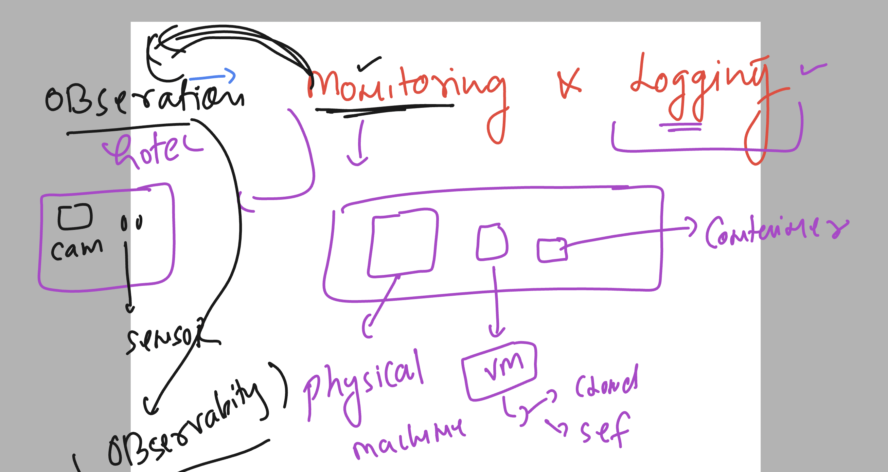
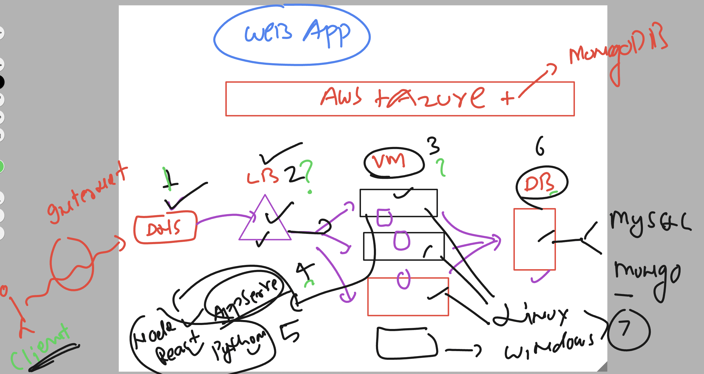
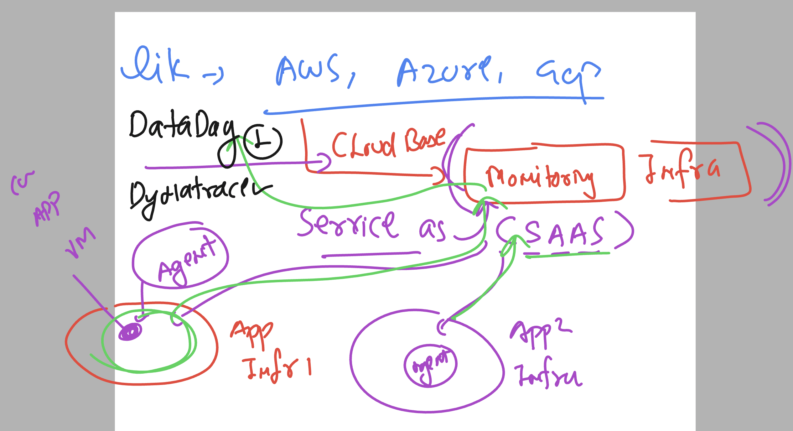
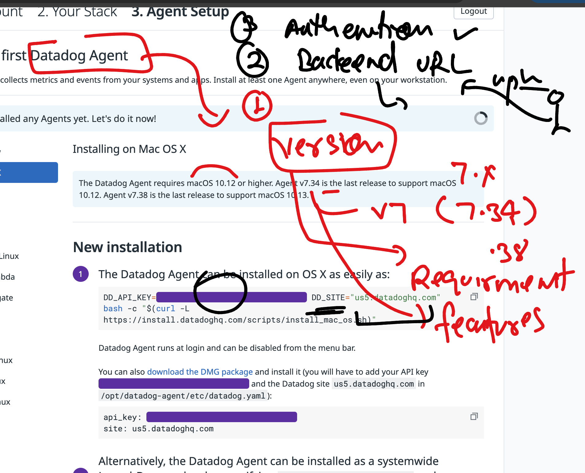
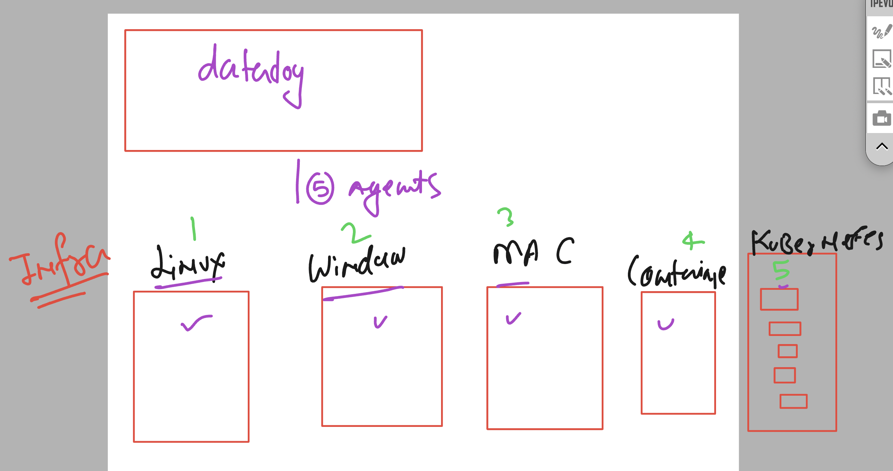

## Datadog story 

### Monitoring to Observability 



### future monitoring and logging case -- Infra + app + db 



### Datadog the SAAS based Monitoring engine 



## Little info about datadog 


### datadog agent basic info 



### first infra setup understanding 



## Installing datadog agent in linux machine 

### checking current username 

```
 
[ec2-user@ip-172-31-92-124 ~]$ whoami
ec2-user
[ec2-user@ip-172-31-92-124 ~]$ 


```

### login with admin /root account 

```
 sudo -i 
[root@ip-172-31-92-124 ~]# 
[root@ip-172-31-92-124 ~]# whoami 
root
[root@ip-172-31-92-124 ~]# 

```

## Installing some dependecy 

```
dnf install -y libxcrypt-compat

```

### Installing 

```
DD_API_KEY="" \
DD_SITE="us5.datadoghq.com" \
bash -c "$(curl -L https://install.datadoghq.com/scripts/install_script_agent7.sh)"

```

## Installation completed

### on linux VM -- datadog config file 

```
 cd  /etc/datadog-agent/

[root@ip-172-31-92-124 datadog-agent]# ls
auth_token  compliance.d  datadog.yaml          environment   install_info        security-agent.yaml.example  system-probe.yaml.example
checks.d    conf.d        datadog.yaml.example  install.json  runtime-security.d  selinux
[root@ip-172-31-92-124 datadog-agent]# 

```

### checking datadog agent  status 

```
systemctl   status  datadog-agent
● datadog-agent.service - Datadog Agent
     Loaded: loaded (/usr/lib/systemd/system/datadog-agent.service; enabled; preset: disabled)
     Active: active (running) since Mon 2024-10-14 09:43:27 UTC; 10min ago
   Main PID: 5166 (agent)
      Tasks: 8 (limit: 4658)

```

### restarting datadog agent 

```
systemctl   restart  datadog-agent
[root@ip-172-31-92-124 datadog-agent]# systemctl   status   datadog-agent
● datadog-agent.service - Datadog Agent
     Loaded: loaded (/usr/lib/systemd/system/datadog-agent.service; enabled; preset: disabled)
     Active: active (running) since Mon 2024-10-14 09:56:41 UTC; 6s ago
   Main PID: 7563 (agent)
      Tasks: 7 (limit: 4658)
     Memory: 90.8M
        CPU: 895ms
     CGroup: /system.slice/datadog-agent.service
             └─7563 /opt/datadog-agent/bin/agent/agent run -p /opt/datadog-agent/run/agent.pid

```


