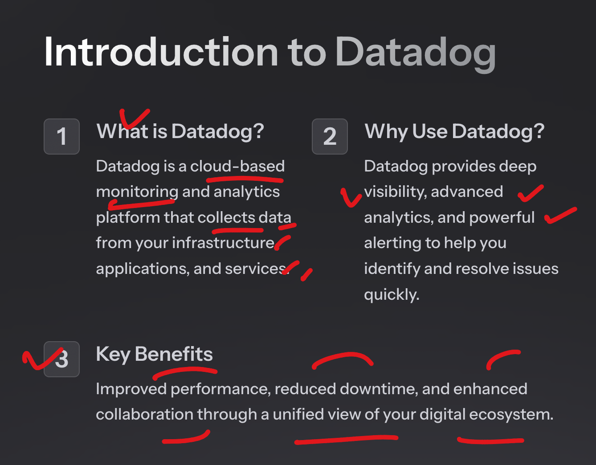
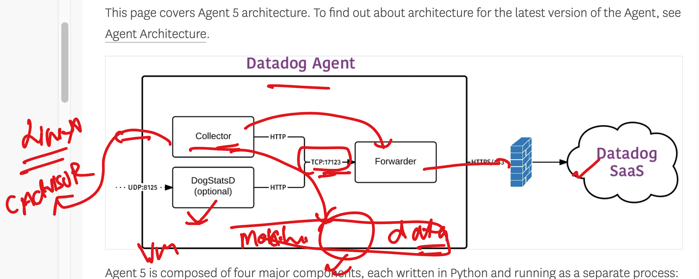

## Datadog story 

### Monitoring to Observability 


### future monitoring and logging case -- Infra + app + db 


### Datadog the SAAS based Monitoring engine 


## Little info about datadog 



### datadog agent basic info 


### first infra setup understanding 


## Installing datadog agent in linux machine 

### checking current username 

```
 
[ec2-user@ip-172-31-92-124 ~]$ whoami
ec2-user
[ec2-user@ip-172-31-92-124 ~]$ 


```

### login with admin /root account 

```
 sudo -i 
[root@ip-172-31-92-124 ~]# 
[root@ip-172-31-92-124 ~]# whoami 
root
[root@ip-172-31-92-124 ~]# 

```

## Installing some dependecy 

```
dnf install -y libxcrypt-compat

```

### Installing 

```
DD_API_KEY="" \
DD_SITE="us5.datadoghq.com" \
bash -c "$(curl -L https://install.datadoghq.com/scripts/install_script_agent7.sh)"

```

## Installation completed

### on linux VM -- datadog config file 

```
 cd  /etc/datadog-agent/

[root@ip-172-31-92-124 datadog-agent]# ls
auth_token  compliance.d  datadog.yaml          environment   install_info        security-agent.yaml.example  system-probe.yaml.example
checks.d    conf.d        datadog.yaml.example  install.json  runtime-security.d  selinux
[root@ip-172-31-92-124 datadog-agent]# 

```

### checking datadog agent  status 

```
systemctl   status  datadog-agent
● datadog-agent.service - Datadog Agent
     Loaded: loaded (/usr/lib/systemd/system/datadog-agent.service; enabled; preset: disabled)
     Active: active (running) since Mon 2024-10-14 09:43:27 UTC; 10min ago
   Main PID: 5166 (agent)
      Tasks: 8 (limit: 4658)

```

### restarting datadog agent 

```
systemctl   restart  datadog-agent
[root@ip-172-31-92-124 datadog-agent]# systemctl   status   datadog-agent
● datadog-agent.service - Datadog Agent
     Loaded: loaded (/usr/lib/systemd/system/datadog-agent.service; enabled; preset: disabled)
     Active: active (running) since Mon 2024-10-14 09:56:41 UTC; 6s ago
   Main PID: 7563 (agent)
      Tasks: 7 (limit: 4658)
     Memory: 90.8M
        CPU: 895ms
     CGroup: /system.slice/datadog-agent.service
             └─7563 /opt/datadog-agent/bin/agent/agent run -p /opt/datadog-agent/run/agent.pid

```


### some datadog agent command which is platform independent 

```
 datadog-agent   status 
Getting the status from the agent.

===============
Agent (v7.57.2)
===============
  Status date: 2024-10-14 10:13:35.855 UTC (1728900815855)
  Agent start: 2024-10-14 09:56:41.514 UTC (1728899801514)
  Pid: 7563

```

### using --help 

```
datadog-agent   --help

The Datadog Agent faithfully collects events and metrics and brings them
to Datadog on your behalf so that you can do something useful with your
monitoring and performance data.

Usage:
  datadog-agent [command]

Available Commands:
  check                 Run the specified check
  completion            Generate the autocompletion script for the specified shell
  config                Print the runtime configuration of a running agent
  configcheck           Print all configurations loaded & resolved of a running agent
  diagnose              Validate Agent installation, configuration and environment
  dogstatsd             Inspect dogstatsd pipeline status
  dogstatsd-capture     Start a dogstatsd UDS traffic capture
  dogstatsd-replay      Replay dogstatsd traffic
  dogstatsd-stats       Print basic statistics on the metrics processed by dogstatsd
  flare                 Collect a flare and send it to Datadog
  health                Print the current agent health


```

## TSDB -- dataformat 


### agent details 



### app servers in industry to host webapps


### app server Understanding 


## Hosting a sample Html code in linux machine 

### taking code from developer 

```

[root@ip-172-31-92-124 ~]# dnf install git -y 
Amazon Linux 2023 repository                  

===> use git clone to download the code 

git  clone  https://github.com/redashu/LKQ_webapp.git

Cloning into 'LKQ_webapp'...
remote: Enumerating objects: 6, done.
remote: Counting objects: 100% (6/6), done.
remote: Compressing objects: 100% (4/4), done.
remote: Total 6 (delta 0), reused 3 (delta 0), pack-reused 0 (from 0)
Receiving objects: 100% (6/6), done.

[root@ip-172-31-92-124 ~]# ls
LKQ_webapp  ddagent-install.log

[root@ip-172-31-92-124 ~]# ls LKQ_webapp/
README.md  index.html
[root@ip-172-31-92-124 ~]# 

```
### setup httpd in linux machine  (http app server)

```
dnf install httpd -y 

===> copy code to app server location 

ls
LKQ_webapp  ddagent-install.log
[root@ip-172-31-92-124 ~]# cp -v LKQ_webapp/index.html   /var/www/html/
'LKQ_webapp/index.html' -> '/var/www/html/index.html'
[root@ip-172-31-92-124 ~]# 

===> starting app server 


systemctl start httpd

```
