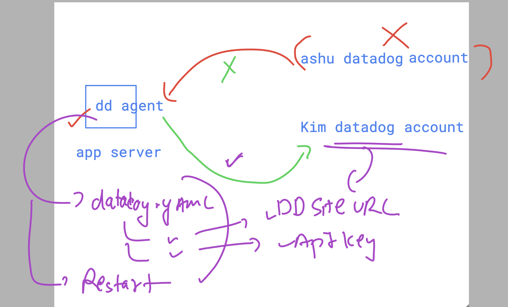

## datadog revision 


### login as admin /root power to hanlde datadog agent service 

```
[ec2-user@ip-172-31-92-124 ~]$ whoami
ec2-user
[ec2-user@ip-172-31-92-124 ~]$ sudo -i 
[root@ip-172-31-92-124 ~]# whoami
root
[root@ip-172-31-92-124 ~]# 

```
### checking status 

```
[root@ip-172-31-92-124 ~]# systemctl status datadog-agent
● datadog-agent.service - Datadog Agent
     Loaded: loaded (/usr/lib/systemd/system/datadog-agent.service; enabled; preset: disabled)
     Active: active (running) since Tue 2024-10-15 06:46:51 UTC; 1h 0min ago
   Main PID: 4815 (agent)
      Tasks: 8 (limit: 4658)
     Memory: 98.0M
        CPU: 25.141s
```

### few more commands 

```
 datadog-agent  version 
Agent 7.57.2 - Commit: 38ba0c7 - Serialization version: v5.0.130 - Go version: go1.22.7
[root@ip-172-31-92-124 ~]# 

===>>

datadog-agent  status 
Getting the status from the agent.

===============
Agent (v7.57.2)
===============
  Status date: 2024-10-15 07:50:26.802 UTC (1728978626802)
  Agent start: 2024-10-15 06:46:51.165 UTC (1728974811165)
  Pid: 4815
  Go Version: go1.22.7
  Python Version: 3.11.8
  Build arch: amd64
  Agent flavor: agent
  Log Level: info

  Paths
  =====
    Config File: /etc/datadog-agent/datadog.yaml
    conf.d: /etc/datadog-agent/conf.d
    checks.d: /etc/datadog-agent/checks.d

========

cd  /etc/datadog-agent/
[root@ip-172-31-92-124 datadog-agent]# ls
auth_token  compliance.d  datadog.yaml          environment   install_info        security-agent.yaml.example  system-probe.yaml.example
checks.d    conf.d        datadog.yaml.example  install.json  runtime-security.d  selinux
[root@ip-172-31-92-124 datadog-agent]# 


```

### datadog account changing in agent side 



### locate your webapp code 

```
 find / -type d -iname LKQ_webapp

```

### location and start app server

```
 ls  /var/www/html/
index.html
[root@ip-172-31-92-124 ~]# systemctl status  httpd
○ httpd.service - The Apache HTTP Server
     Loaded: loaded (/usr/lib/systemd/system/httpd.service; disabled; preset: disabled)
     Active: inactive (dead)
       Docs: man:httpd.service(8)
[root@ip-172-31-92-124 ~]# systemctl start   httpd
[root@ip-172-31-92-124 ~]# 

```

## enable live process monitoring using datadog agent in linux & windows systems

[click_here](https://docs.datadoghq.com/infrastructure/process/?tab=linuxwindows)

### you can change in datadog.yaml file 

```
process_config:
  process_collection:
    enabled: true
```

### in linux i am making a change 

```
nano  /etc/datadog-agent/datadog.yaml 

===

datadog-agent  configcheck

=== container_image check ===
Configuration provider: file
Configuration source: file:/etc/datadog-agent/conf.d/container_image.d/conf.yaml.default
Config for instance ID: container_image:352c6bb6615b44c3
{}
~
Auto-discovery IDs:

```

### restart service 

```
systemctl  restart datadog-agent
[root@ip-172-31-92-124 ~]# systemctl  status  datadog-agent
● datadog-agent.service - Datadog Agent
     Loaded: loaded (/usr/lib/systemd/system/datadog-agent.service; enabled; preset: disabled)
     Active: active (running) since Tue 2024-10-15 09:02:07 UTC; 5s ago
   Main PID: 28677 (agent)
      Tasks: 8 (limit: 4658)

```
