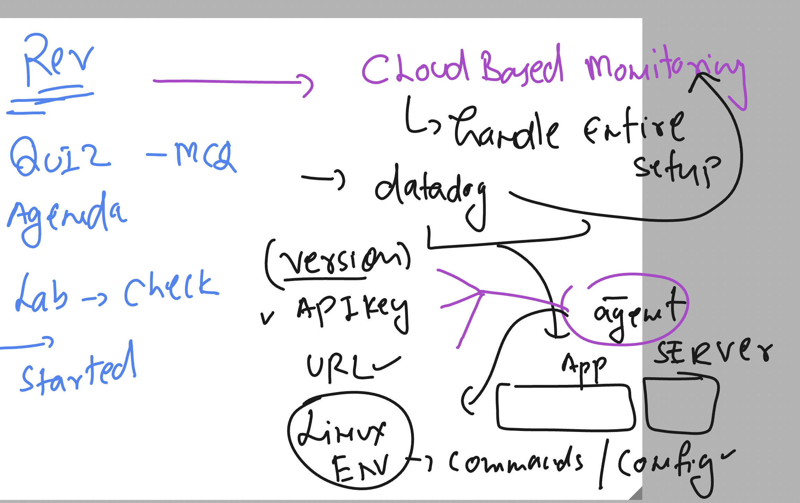

## datadog revision 



### login as admin /root power to hanlde datadog agent service 

```
[ec2-user@ip-172-31-92-124 ~]$ whoami
ec2-user
[ec2-user@ip-172-31-92-124 ~]$ sudo -i 
[root@ip-172-31-92-124 ~]# whoami
root
[root@ip-172-31-92-124 ~]# 

```
### checking status 

```
[root@ip-172-31-92-124 ~]# systemctl status datadog-agent
● datadog-agent.service - Datadog Agent
     Loaded: loaded (/usr/lib/systemd/system/datadog-agent.service; enabled; preset: disabled)
     Active: active (running) since Tue 2024-10-15 06:46:51 UTC; 1h 0min ago
   Main PID: 4815 (agent)
      Tasks: 8 (limit: 4658)
     Memory: 98.0M
        CPU: 25.141s
```

### few more commands 

```
 datadog-agent  version 
Agent 7.57.2 - Commit: 38ba0c7 - Serialization version: v5.0.130 - Go version: go1.22.7
[root@ip-172-31-92-124 ~]# 

===>>

datadog-agent  status 
Getting the status from the agent.

===============
Agent (v7.57.2)
===============
  Status date: 2024-10-15 07:50:26.802 UTC (1728978626802)
  Agent start: 2024-10-15 06:46:51.165 UTC (1728974811165)
  Pid: 4815
  Go Version: go1.22.7
  Python Version: 3.11.8
  Build arch: amd64
  Agent flavor: agent
  Log Level: info

  Paths
  =====
    Config File: /etc/datadog-agent/datadog.yaml
    conf.d: /etc/datadog-agent/conf.d
    checks.d: /etc/datadog-agent/checks.d

========
```
