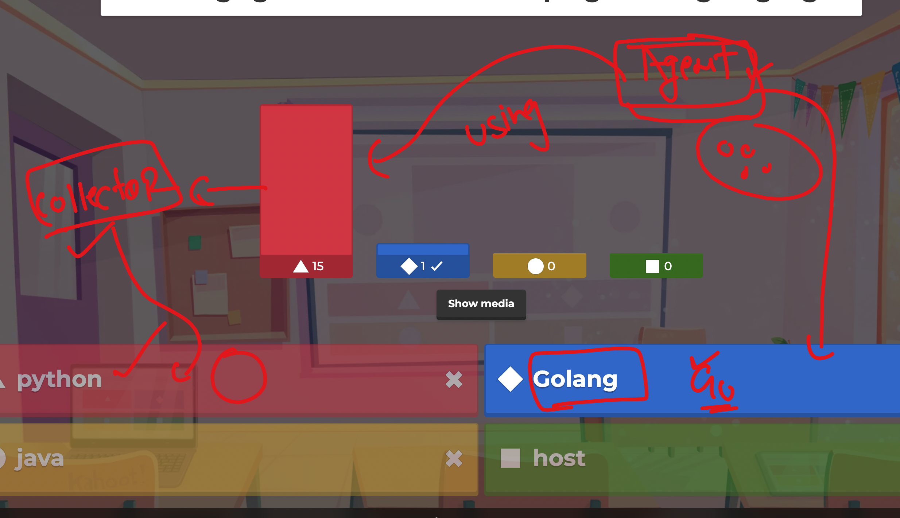
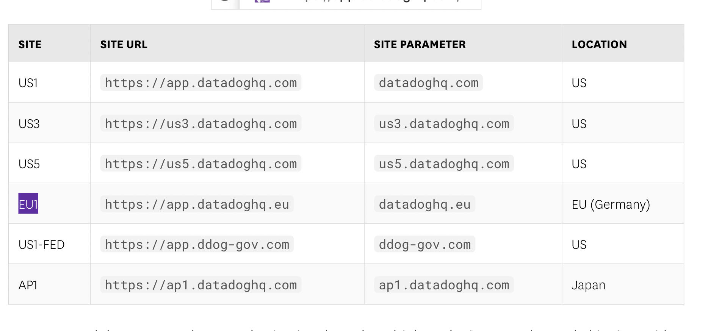
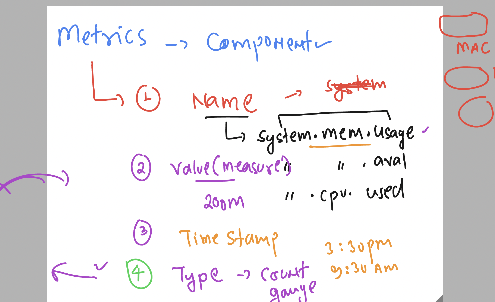
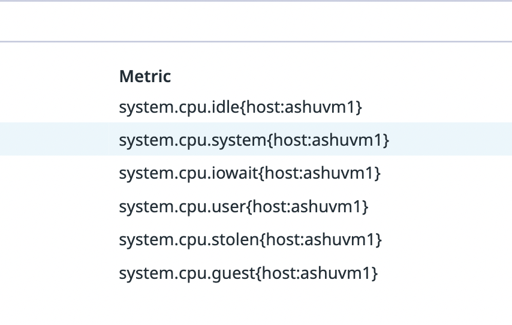
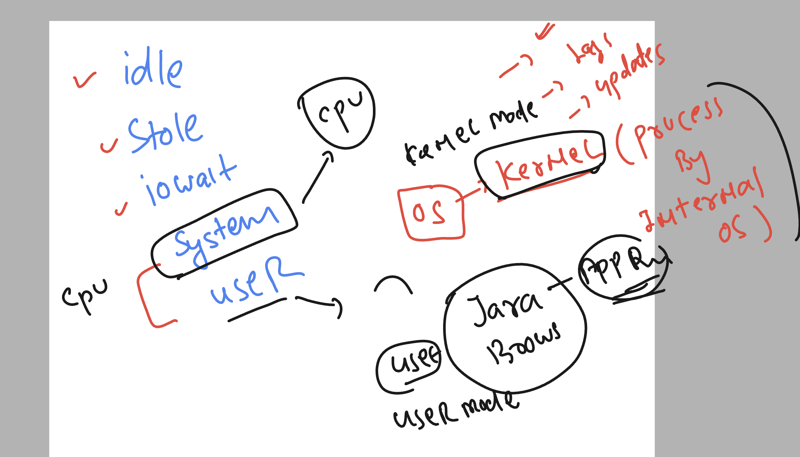

## Datadog Revision 


### datadog agent more info 


## datadog agent -- Golang vs Python understanding 



### datadog Login URL 


```
https://app.datadoghq.com/
```

[click_here](https://app.datadoghq.com/)

### datadog account with their official data centre region 



## Intro metrics in datadog 


## Metrics components in datadog 



### by default CPU metrics collected by datadog agent collector 



### system vs user cpu metrics 



