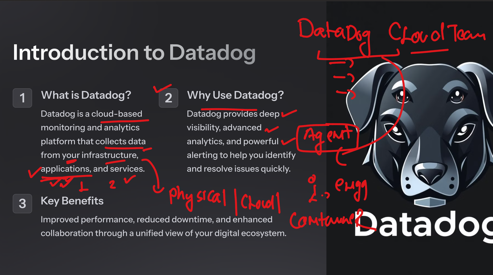
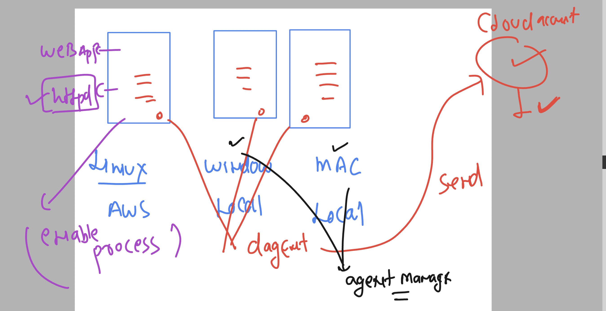
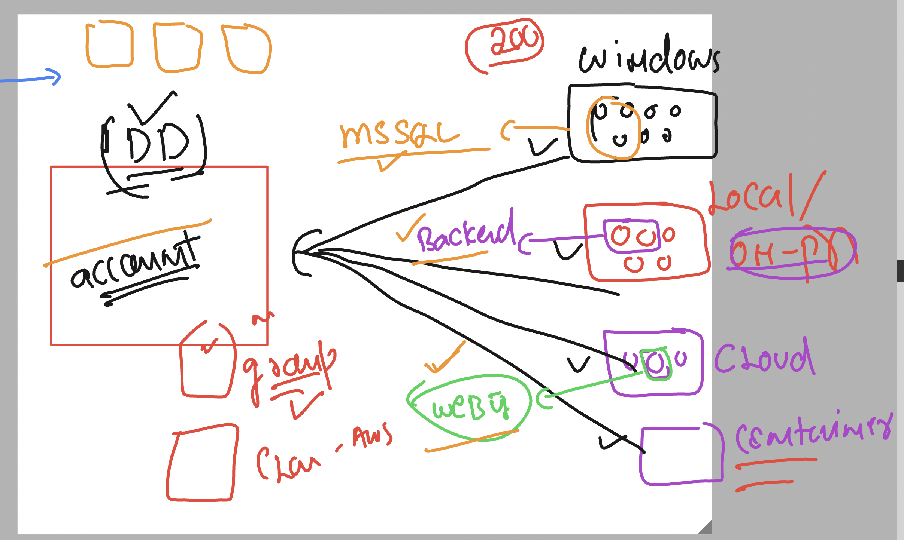
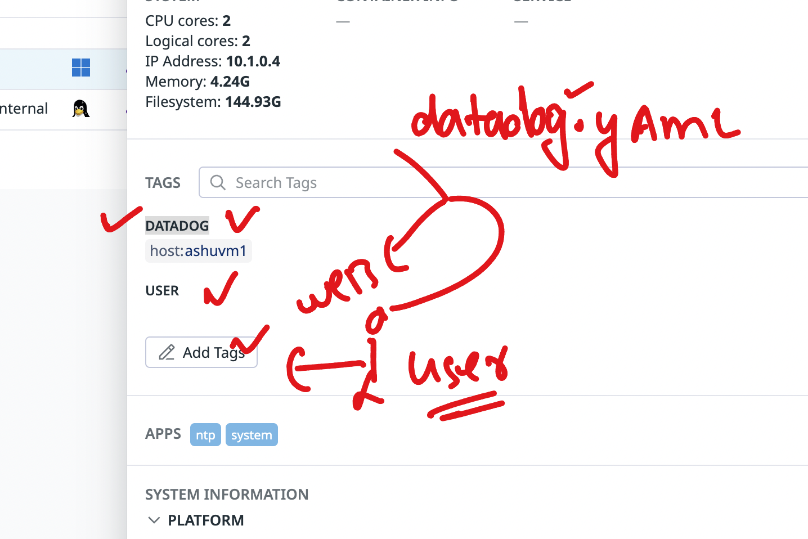
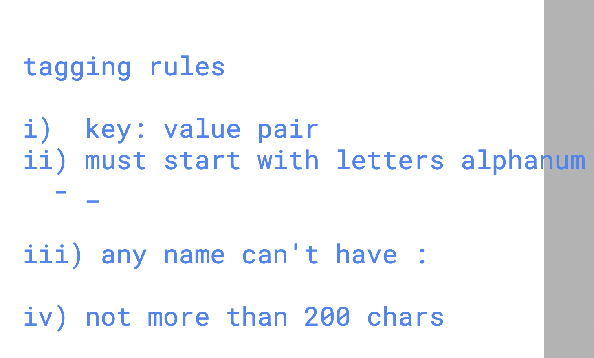
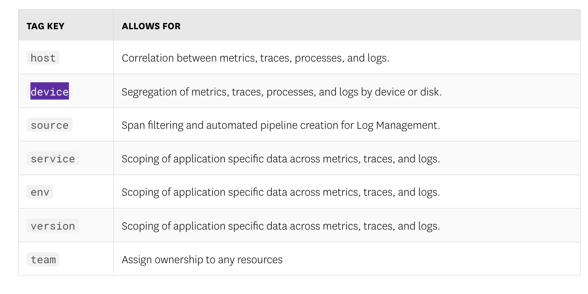

## Datadog Revision 



### datadog agent more info 



## datadog agent -- Golang vs Python understanding 


### datadog Login URL 


```
https://app.datadoghq.com/
```

[click_here](https://app.datadoghq.com/)

### datadog account with their official data centre region 


## Intro metrics in datadog 


## Metrics components in datadog 


### by default CPU metrics collected by datadog agent collector 


### system vs user cpu metrics 


## Grouping and filtering concept in datadog 



## tags info 



### tag limits 



### Tags changing places 


### Reserver tags key

[click_here](https://docs.datadoghq.com/getting_started/tagging/)



