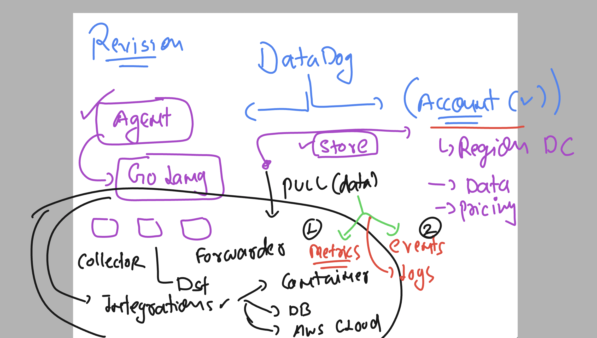
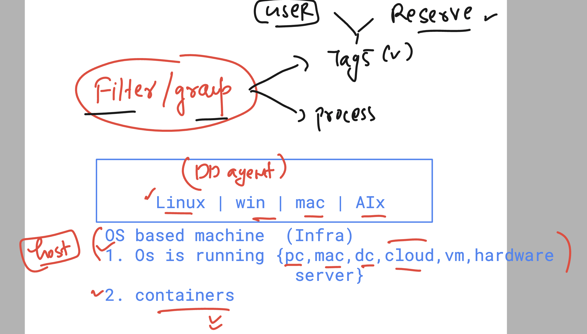
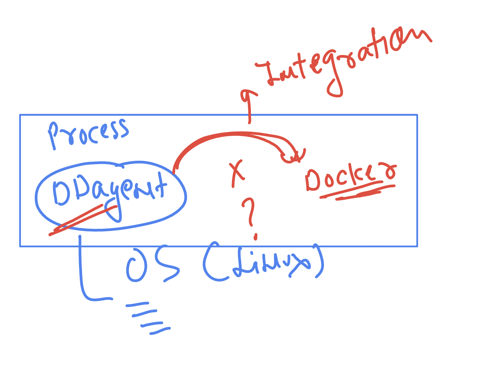
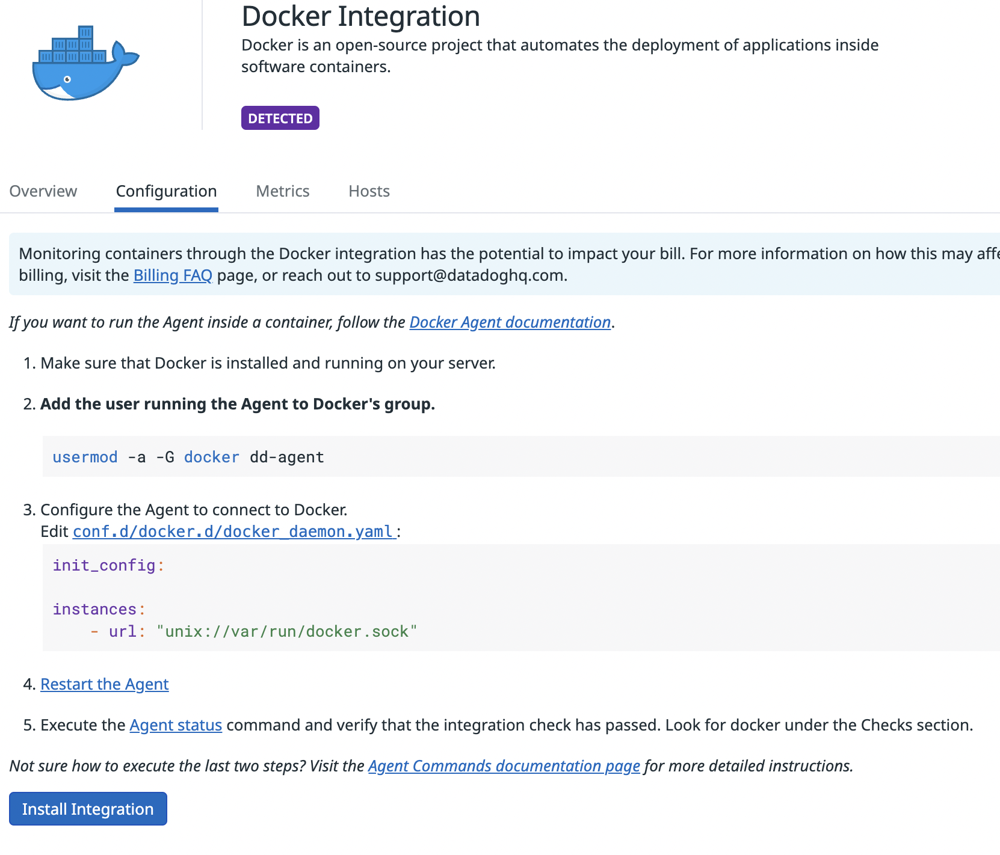

### datadog account and agent revision 



### datadog agent process and tags



### checking agent status on linux vm

```
 whoami
ec2-user
[ec2-user@ip-172-31-92-124 ~]$ sudo -i
[root@ip-172-31-92-124 ~]# systemctl status datadog-agent
● datadog-agent.service - Datadog Agent
     Loaded: loaded (/usr/lib/systemd/system/datadog-agent.service; enabled; preset: disabled)
     Active: active (running) since Thu 2024-10-17 07:37:41 UTC; 49s ago
   Main PID: 2080 (agent)
      Tasks: 8 (limit: 4658)
     Memory: 266.1M
        CPU: 1.377s
```

### Installing Docker on LInux machine 

```
yum install docker -y 

====>
 systemctl start docker 
[root@ip-172-31-92-124 ~]# systemctl status  docker 
● docker.service - Docker Application Container Engine
     Loaded: loaded (/usr/lib/systemd/system/docker.service; disabled; preset: disabled)
     Active: active (running) since Thu 2024-10-17 08:33:35 UTC; 7s ago
TriggeredBy: ● docker.socket

```

### Creating your first container 

```
docker run -itd  --name ashuc1  -p 1234:80  nginx 

===>
docker ps
CONTAINER ID   IMAGE     COMMAND                  CREATED         STATUS         PORTS                                   NAMES
048f7f6a9087   nginx     "/docker-entrypoint.…"   5 seconds ago   Up 4 seconds   0.0.0.0:1234->80/tcp, :::1234->80/tcp   ashuc1
[root@ip-172-31-92-124 ~]# 


```

## datadog agent & docker integrations 



### integration image 



### adding user to docker group 

```
 usermod -a -G docker dd-agent
```

### to go conf.d 

```
 cd /etc/datadog-agent/
[root@ip-172-31-92-124 datadog-agent]# ls
auth_token  compliance.d  datadog.yaml          environment   install_info        security-agent.yaml.example  system-probe.yaml.example
checks.d    conf.d        datadog.yaml.example  install.json  runtime-security.d  selinux
[root@ip-172-31-92-124 datadog-agent]# cd conf.d/
[root@ip-172-31-92-124 conf.d]# pwd
/etc/datadog-agent/conf.d
[root@ip-172-31-92-124 conf.d]# ls
activemq.d                     cri.d                    ignite.d                         nginx.d                     sonarqube.d
activemq_xml.d                 crio.d                   impala.d                         nginx_ingress_controller.d  spark.d
aerospike.d                    datadog_cluster_agent.d  io.d                             ntp.d                       sqlserver.d
airflow.d                      dcgm.d                   istio.d                          nvidia_triton.d             squid.d
amazon_msk.d                   directory.d              jboss_wildfly.d                  oom_kill.d                  ssh_check.d
ambari.d                       disk.d                   jetson.d                         openldap.d                  statsd.d
apache.d                       dns_check.d            

```

### go to docker lcoation 

```
cd /etc/datadog-agent/conf.d/docker.d
cp conf.yaml.default  conf.yaml

===> nano conf.yaml 

====>
 datadog-agent configcheck 

===>
@ip-172-31-92-124 docker.d]# systemctl  restart datadog-agent
[root@ip-172-31-92-124 docker.d]# systemctl  status  datadog-agent
● datadog-agent.service - Datadog Agent
     Loaded: loaded (/usr/lib/systemd/system/datadog-agent.service; enabled; preset: disabled)
     Active: active (running) since Thu 2024-10-17 09:09:52 UTC; 5s ago
   Main PID: 21237 (agent)
      Tasks: 8 (limit: 4658)
```

### containers 

```
docker run -itd  --name ashucweb1  -p 1235:80  nginx 
28b11a9be258bd699b0295fc5aef215d4ec6aa6c495d2564425f0abd1292e890
[root@ip-172-31-92-124 docker.d]# docker run -itd  --name ashucweb2  -p 1236:80  nginx 
242fd019122eadb6cedc9680914067cc8b7fe687314b6898c72519d5c98bd4fa
[root@ip-172-31-92-124 docker.d]# docker ps
CONTAINER ID   IMAGE     COMMAND                  CREATED             STATUS             PORTS                                   NAMES
242fd019122e   nginx     "/docker-entrypoint.…"   3 seconds ago       Up 2 seconds       0.0.0.0:1236->80/tcp, :::1236->80/tcp   ashucweb2
28b11a9be258   nginx     "/docker-entrypoint.…"   11 seconds ago      Up 10 seconds      0.0.0.0:1235->80/tcp, :::1235->80/tcp   ashucweb1
10a18c4758cc   python    "python3"                52 minutes ago      Up 52 minutes                                              ashuc2
048f7f6a9087   nginx     "/docker-entrypoint.…"   About an hour ago   Up About an hour   0.0.0.0:1234->80/tcp, :::1234->80/tcp   ashuc1
[root@ip-172-31-92-124 docker.d]# 


```

### creating 2 more webapp container 

```
docker run -itd  --name ashucweb1  -p 1235:80  nginx 
docker run -itd  --name ashucweb2  -p 1236:80  nginx
```