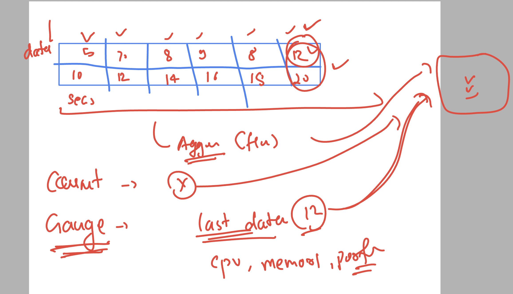

### Revision 


### datadog agent host os vs container based agent 


## on linux agent 

### checking docker and container status 

```
ec2-user@ip-172-31-92-124 ~]$ sudo -i
[root@ip-172-31-92-124 ~]# systemctl status docker
● docker.service - Docker Application Container Engine
     Loaded: loaded (/usr/lib/systemd/system/docker.service; disabled; preset: disabled)
     Active: active (running) since Fri 2024-10-18 07:53:32 UTC; 2min 10s ago
TriggeredBy: ● docker.socket
       Docs: https://docs.docker.com
    Process: 2273 ExecStartPre=/bin/mkdir -p /run/docker (cod

=>> to start docker on vm start 

systemctl enable --now  docker


===> checking datadog agent status 

systemctl status datadog-agent
● datadog-agent.service - Datadog Agent
     Loaded: loaded (/usr/lib/systemd/system/datadog-agent.service; enabled; preset: disabled)
     Active: active (running) since Fri 2024-10-18 07:53:27 UTC; 4min 14s ago
   Main PID: 2064 (agent)
      Tasks: 8 (limit: 4658)
     Memory: 268.6M
```

### contaiers are not running by default 

```
root@ip-172-31-92-124 ~]# docker run -itd  --name ashuappnew1  -p 1234:80  nginx 
8ab69ee7bb0e11825a38ad23bf79e63326811bdc8b0aaa5f60a8dac91a02aba3
[root@ip-172-31-92-124 ~]# docker run -itd  --name ashuappnew2  -p 1235:80  nginx 
d66b0a0fe5824009566433c514b7499b2369c078e54af3ba0ee6ce878cae746f
[root@ip-172-31-92-124 ~]# docker ps
CONTAINER ID   IMAGE     COMMAND                  CREATED          STATUS          PORTS                                   NAMES
d66b0a0fe582   nginx     "/docker-entrypoint.…"   3 seconds ago    Up 2 seconds    0.0.0.0:1235->80/tcp, :::1235->80/tcp   ashuappnew2
8ab69ee7bb0e   nginx     "/docker-entrypoint.…"   14 seconds ago   Up 13 seconds   0.0.0.0:1234->80/tcp, :::1234->80/tcp   ashuappnew1
[root@ip-172-31-92-124 ~]# 
[root@ip-172-31-92-124 ~]# systemctl restart docker
[root@ip-172-31-92-124 ~]# docker ps
CONTAINER ID   IMAGE     COMMAND   CREATED   STATUS    PORTS     NAMES
[root@ip-172-31-92-124 ~]# docker ps -a
CONTAINER ID   IMAGE     COMMAND                  CREATED          STATUS                      PORTS     NAMES
d66b0a0fe582   nginx     "/docker-entrypoint.…"   27 seconds ago   Exited (0) 13 seconds ago             ashuappnew2
8ab69ee7bb0e   nginx     "/docker-entrypoint.…"   38 seconds ago   Exited (0) 13 seconds ago             ashuappnew1
[root@ip-172-31-92-124 ~]# 
[root@ip-172-31-92-124 ~]# docker start  ashuappnew1 ashuappnew2
ashuappnew1
ashuappnew2
[root@ip-172-31-92-124 ~]# docker ps
CONTAINER ID   IMAGE     COMMAND                  CREATED          STATUS         PORTS                                   NAMES
d66b0a0fe582   nginx     "/docker-entrypoint.…"   45 seconds ago   Up 2 seconds   0.0.0.0:1235->80/tcp, :::1235->80/tcp   ashuappnew2
8ab69ee7bb0e   nginx     "/docker-entrypoint.…"   56 seconds ago   Up 2 seconds   0.0.0.0:1234->80/tcp, :::1234->80/tcp   ashuappnew1
[root@ip-172-31-92-124 ~]# 

```

### to start all the containers in one shot 

```
docker start $(docker ps -aq)
```

### creating a container agent 

```
docker run -d --name dd-agent \
-e DD_API_KEY="<putyourapikey>" \
-e DD_SITE="us5.datadoghq.com" \
-v /var/run/docker.sock:/var/run/docker.sock:ro \
-v /proc/:/host/proc/:ro \
-v /sys/fs/cgroup/:/host/sys/fs/cgroup:ro \
-v /var/lib/docker/containers:/var/lib/docker/containers:ro \
  --restart always -v /etc/passwd:/etc/passwd:ro  -e DD_PROCESS_CONFIG_PROCESS_COLLECTION_ENABLED=true   gcr.io/datadoghq/agent:7
Unable to find image 'gcr.io/datadoghq/agent:7' locally
7: Pulling from datadoghq/agent
98da444ef91b: Pull complete 
Digest: sha256:5004bdca0d09b96cb872a48115500931ce597507c67897eeacde7fbdec493a05
Status: Downloaded newer image for gcr.io/datadoghq/agent:7
f1d7018897eeb8c9bc3316aa982ce082aa47dde83a229bb3566c820d37bb1266
[root@ip-172-31-82-114 ~]# docker  ps
CONTAINER ID   IMAGE                      COMMAND                CREATED          STATUS                            PORTS                NAMES
f1d7018897ee   gcr.io/datadoghq/agent:7   "/bin/entrypoint.sh"   10 seconds ago   Up 4 seconds (health: starting)   8125/udp, 8126/tcp   dd-agent
[root@ip-172-31-82-114 ~]# 

```

## Metrics info in datadog agent 


### types 

[click_here](https://docs.datadoghq.com/metrics/types/?tab=count)


## metrics collection and aggregation 


### Gauge metrics - cpu percentage showing 



### to find out info from datadog metrics we can search like DBA 


