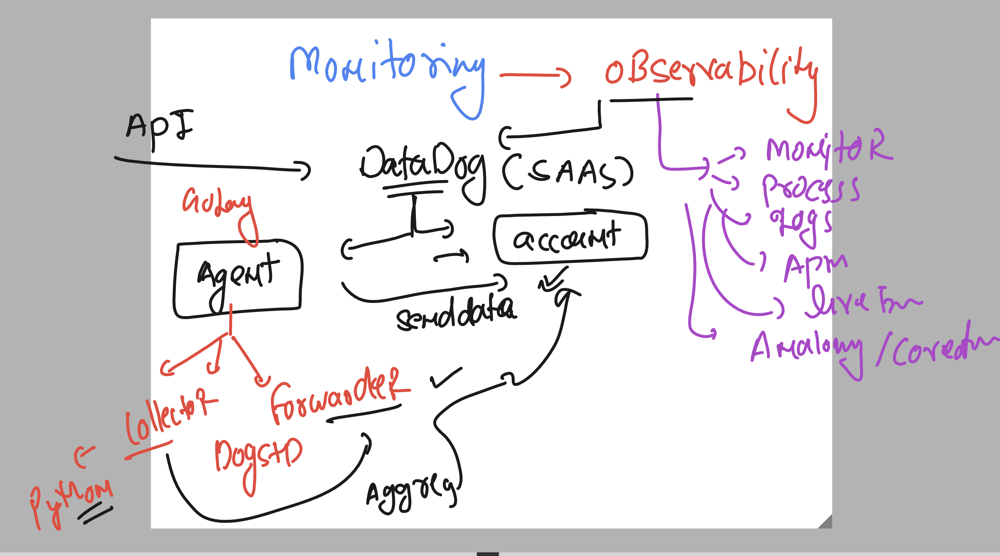
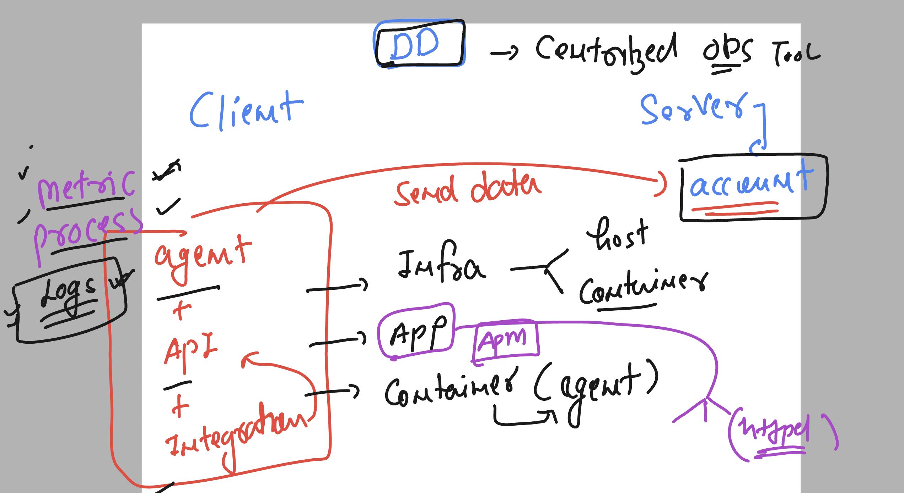
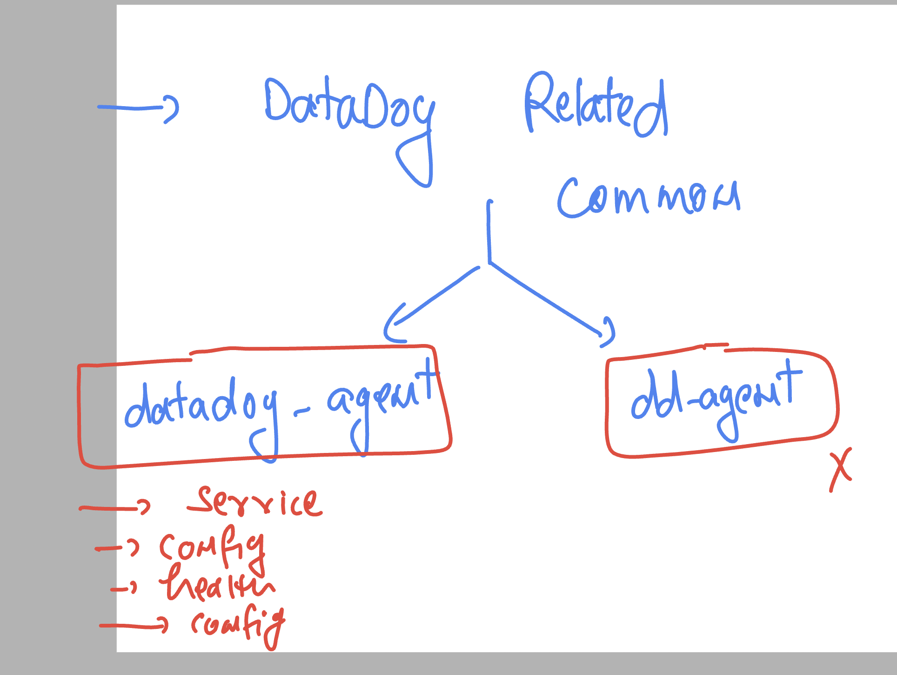
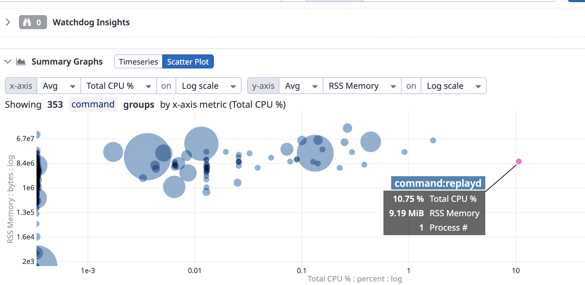
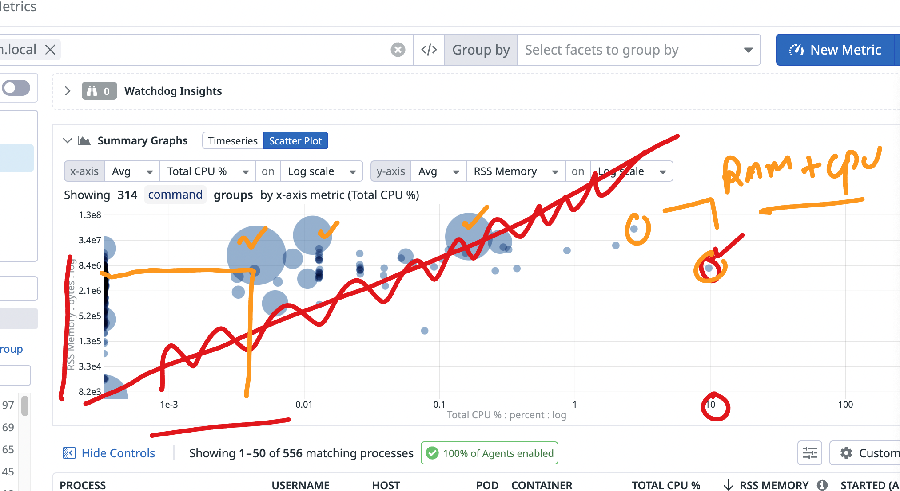
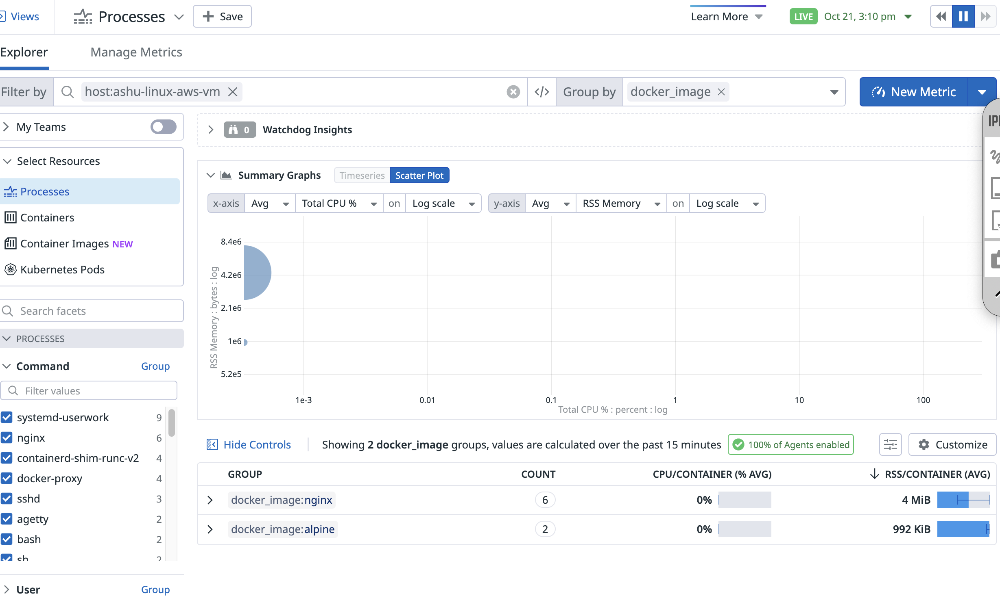
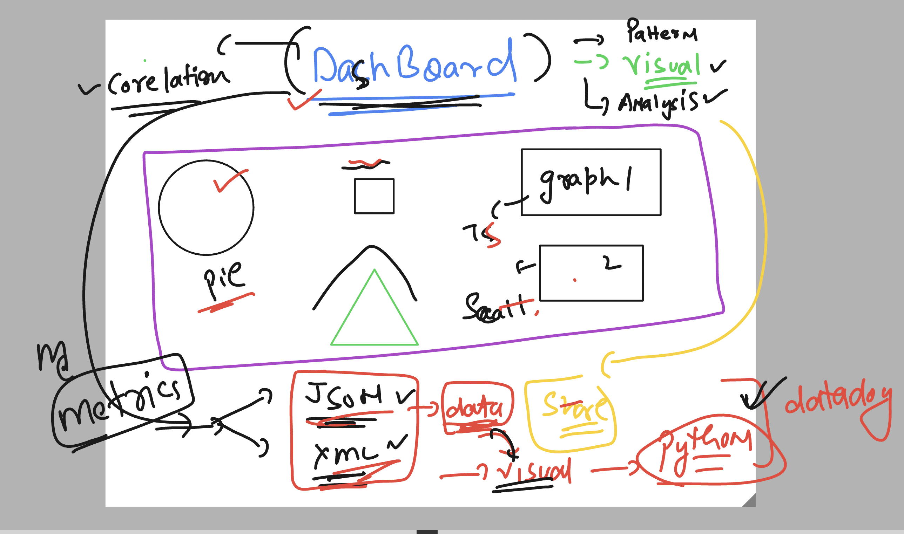

### datadog revision 



### info about dd 



###  checking datadog status 

```
[ec2-user@ip-172-31-92-124 ~]$ whoami
ec2-user
[ec2-user@ip-172-31-92-124 ~]$ sudo -i
[root@ip-172-31-92-124 ~]# systemctl status datadog-agent
● datadog-agent.service - Datadog Agent
     Loaded: loaded (/usr/lib/systemd/system/datadog-agent.service; enabled; preset: disabled)
     Active: active (running) since Mon 2024-10-21 07:46:53 UTC; 3min 11s ago
   Main PID: 2088 (agent)
      Tasks: 9 (limit: 4658)
     Memory: 267.1M
        CPU: 2.570s
     CGroup: /system.slice/datadog-agent.service
             └─2088 /opt/datadog-agent/bin/agent/agent run -p /opt/datadog-agent/run/agent.pid

Oct 21 07:48:10 ip-172-31-92-124.ec2.internal agent[2088]: 2024-10-21 07:48:10 UTC | CORE | INFO | (pkg/collector/worker/check_logger.go:4>
Oct 21 07:48:10 ip-172-31-92-124.ec2.internal agent[2088]: 2024-10-21 07:48:10 UTC | CORE | INFO | (pkg/collector/worker/check_logger.go:5>
Oct 21 07:48:11 ip-172-31-92-124.ec2.internal agent[2088]: 2024-10-21 07:48:11 UTC | CORE | INFO | (pkg/collector/worker/check_logger.go:4>
Oct 21 07:48:11 ip-172-31-92-124.ec2.internal agent[2088]: 2024-10-21 07:48:11 UTC | CORE | INFO | (pkg/collector/worker/check_logger.go:5>
Oct 21 07:48:12 ip-172-31-92-124.ec2.internal agent[2088]: 2024-10-21 07:48:12 UTC | CORE | INFO | (pkg/collector/worker/check_logger.go:4>
Oct 21 07:48:12 ip-172-31-92-124.ec2.internal agent[2088]: 2024-10-21 07:48:12 UTC | CORE | INFO | (pkg/collector/worker/check_logger.go:5>
Oct 21 07:48:13 ip-172-31-92-124.ec2.internal agent[2088]: 2024-10-21 07:48:13 UTC | CORE | INFO | (pkg/collector/worker/check_logger.go:4>
Oct 21 07:48:13 ip-172-31-92-124.ec2.internal agent[2088]: 2024-10-21 07:48:13 UTC | CORE | INFO | (pkg/collector/worker/check_logger.go:5>
Oct 21 07:48:14 ip-172-31-92-124.ec2.internal agent[2088]: 2024-10-21 07:48:14 UTC | CORE | INFO | (pkg/collector/worker/check_logger.go:4>
Oct 21 07:48:14 ip-172-31-92-124.ec2.internal agent[2088]: 2024-10-21 07:48:14 UTC | CORE | INFO | (pkg/collector/worker/check_logger.go:5>
[root@ip-172-31-92-124 ~]# datadog-agent status
Getting the status from the agent.

===============
Agent (v7.57.2)
===============
  Status date: 2024-10-21 07:50:18.381 UTC (1729497018381)
  Agent start: 2024-10-21 07:46:55.228 UTC (1729496815228)
  Pid: 2088
  Go Version: go1.22.7
  Python Version: 3.11.8
  Build arch: amd64
  Agent flavor: agent
  Log Level: info

  Paths
  =====

```

### datadog agent important commands 



### list of datadog-agent options 

```
datadog-agent 

The Datadog Agent faithfully collects events and metrics and brings them
to Datadog on your behalf so that you can do something useful with your
monitoring and performance data.

Usage:
  datadog-agent [command]

Available Commands:
  check                 Run the specified check
  completion            Generate the autocompletion script for the specified shell
  config                Print the runtime configuration of a running agent
  configcheck           Print all configurations loaded & resolved of a running agent
  diagnose              Validate Agent installation, configuration and environment
  dogstatsd             Inspect dogstatsd pipeline status
  dogstatsd-capture     Start a dogstatsd UDS traffic capture
  dogstatsd-replay      Replay dogstatsd traffic
  dogstatsd-stats       Print basic statistics on t

```
### showing current datadog agent config file detail 

```
datadog-agent config
```

### datadog agent health status

```
root@ip-172-31-92-124 datadog-agent]# datadog-agent health 
Agent health: PASS
=== 15 healthy components ===
ad-config-provider-kubernetes-container-allinone, ad-containerlistener, ad-servicelistening, aggregator, collector-queue-15s, collector-queue-900s, dogstatsd-main, forwarder, healthcheck, healthcheck, tagger-store, tagger-workloadmeta, workloadmeta-docker, workloadmeta-puller, workloadmeta-store
[root@ip-172-31-92-124 datadog-agent]# 

```

### current hostname of datadog agent reporting -- 

```
datadog-agent hostname
ashu-linux-aws-vm

===>

[root@ip-172-31-92-124 datadog-agent]# hostname
ip-172-31-92-124.ec2.internal
[root@ip-172-31-92-124 datadog-agent]# 

```
### datadog agent process is havign 2 visual options 



## Timeseries graph understanding 



### creating 4 containers 

```
[root@ip-172-31-92-124 ~]# 
[root@ip-172-31-92-124 ~]# docker run -dit --name ashuc1 -p 1234:80 nginx 
40be356ad362711bf72c6725cf9ba6a9894bb99615c7e2a992d82fc79ea9715a
[root@ip-172-31-92-124 ~]# docker run -dit --name ashuc2 -p 1235:80 nginx 
06796c656c307b3f72805aea80d954a61969c13927eb832247013c998767b06c
[root@ip-172-31-92-124 ~]# 
[root@ip-172-31-92-124 ~]# docker run -itd --name ashualpcc1 alpine 
410a1838fa91540ea45dc816253bf5153fdedf1b6589111626400472f0698400
[root@ip-172-31-92-124 ~]# docker run -itd --name ashualpcc2 alpine 
eed3de0c87357cf0b15c66696b9e2f960895083cbe193b59dd2abfd1ebb8500c
[root@ip-172-31-92-124 ~]# 

```

### creating process scatter plot graph 



### creating dashboards in datadog 



