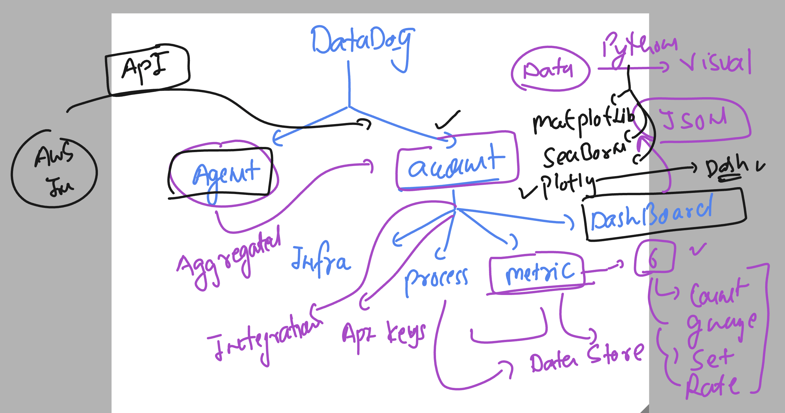
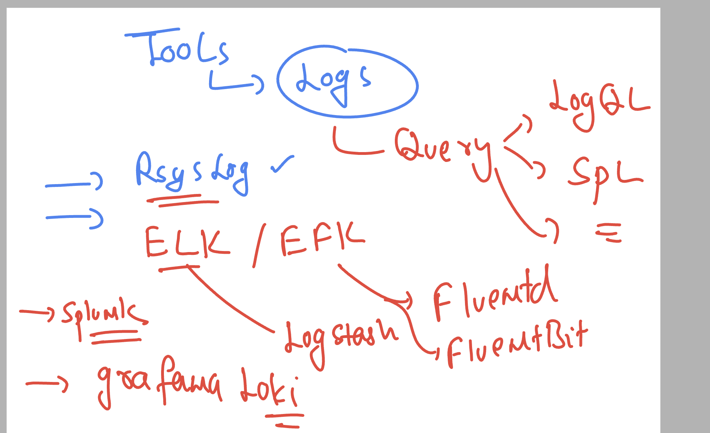
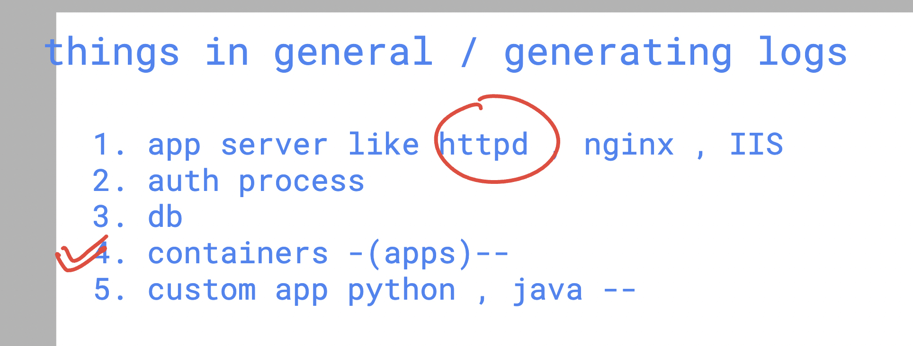
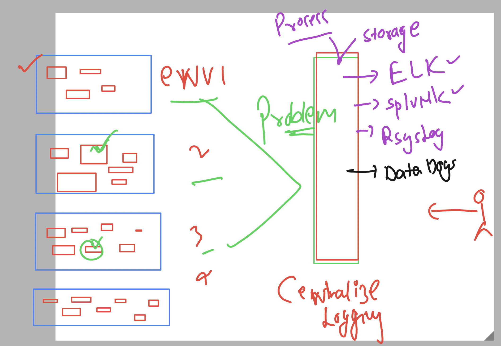

## Revision 



### logs in picture 



### things which are generating logs 



## checking logs with containers 

### remove all existing containers

```
docker rm $(docker ps -aq) -f
```

### Now create a new webapp container 

```
docker run -tid --name ashuxyzc1 -p 1234:80 nginx 
c96689d4c4dfefb3acdb7e5aa51279fd777e1fbae0bdae30af7e735bc2c26e38

[root@ip-172-31-92-124 ~]# docker ps
CONTAINER ID   IMAGE     COMMAND                  CREATED          STATUS          PORTS                                   NAMES
b958cd9929ad   nginx     "/docker-entrypoint.…"   10 seconds ago   Up 9 seconds    0.0.0.0:2345->80/tcp, :::2345->80/tcp   ilonewebc1
c96689d4c4df   nginx     "/docker-entrypoint.…"   21 seconds ago   Up 20 seconds   0.0.0.0:1234->80/tcp, :::1234->80/tcp   ashuxyzc1
[root@ip-172-31-92-124 ~]# 


```

### checking logs of container 

```
docker logs ashuxyzc1 


/docker-entrypoint.sh: /docker-entrypoint.d/ is not empty, will attempt to perform configuration
/docker-entrypoint.sh: Looking for shell scripts in /docker-entrypoint.d/
/docker-entrypoint.sh: Launching /docker-entrypoint.d/10-listen-on-ipv6-by-default.sh
10-listen-on-ipv6-by-default.sh: info: Getting the checksum of /etc/nginx/conf.d/default.conf
10-listen-on-ipv6-by-default.sh: info: Enabled listen on IPv6 in /etc/nginx/conf.d/default.conf
/docker-entrypoint.sh: Sourcing /docker-entrypoint.d/15-local-resolvers.envsh
/docker-entrypoint.sh: Launching /docker-entrypoint.d/20-envsubst-on-templates.sh
/docker-entrypoint.sh: Launching /docker-entrypoint.d/30-tune-worker-processes.sh
/docker-entrypoint.sh: Configuration complete; ready for start up
2024/10/22 07:45:27 [notice] 1#1: using the "epoll" event method
2024/10/22 07:45:27 [notice] 1#1: nginx/1.27.2
2024/10/22 07:45:27 [notice] 1#1: built by gcc 12.2.0 (Debian 12.2.0-14) 
2024/10/22 07:45:27 [notice] 1#1: OS: Linux 6.1.109-118.189.amzn2023.x86_64
2024/10/22 07:45:27 [notice] 1#1: getrlimit(RLIMIT_NOFILE): 32768:65536
2024/10/22 07:45:27 [notice] 1#1: start worker processes
2024/10/22 07:45:27 [notice] 1#1: start worker process 28
2024/10/22 07:45:27 [notice] 1#1: start worker process 29
[root@ip-172-31-92-124 ~]# 

```

### lets test with another container 

```
 docker run -itd --name ashuxu1 alpine ping fb.com 

====>
docker logs  ashuxu1 
PING fb.com (157.240.229.35): 56 data bytes
64 bytes from 157.240.229.35: seq=0 ttl=54 time=1.900 ms
64 bytes from 157.240.229.35: seq=1 ttl=54 time=2.712 ms
```

## checking apache httpd app server logs 

```
 yum install httpd 
Last metadata expiration check: 1 day, 0:08:37 ago on Mon Oct 21 07:46:58 2024.
Package httpd-2.4.62-1.amzn2023.x86_64 is already installed.
Dependencies resolved.
Nothing to do.
Complete!
[root@ip-172-31-92-124 ~]# 
[root@ip-172-31-92-124 ~]# ls  /var/www/html/
index.html
[root@ip-172-31-92-124 ~]# 
[root@ip-172-31-92-124 ~]# systemctl status httpd
○ httpd.service - The Apache HTTP Server
     Loaded: loaded (/usr/lib/systemd/system/httpd.service; disabled; preset: disabled)
     Active: inactive (dead)
       Docs: man:httpd.service(8)

Oct 22 07:42:20 ip-172-31-92-124.ec2.internal systemd[1]: httpd.service: Unit cannot be reloaded because it is inactive.
[root@ip-172-31-92-124 ~]# systemctl start httpd
[root@ip-172-31-92-124 ~]# systemctl status httpd
● httpd.service - The Apache HTTP Server
     Loaded: loaded (/usr/lib/systemd/system/httpd.service; disabled; preset: disabled)
     Active: active (running) since Tue 2024-10-22 07:56:20 UTC; 2s ago
       Docs: man:httpd.service(8)

```

### checking logs of apache httpd

```
cd /var/log/
[root@ip-172-31-92-124 log]# ls
README  audit  chrony                 cloud-init.log  dnf.librepo.log  dnf.rpm.log  hawkey.log-20241022  journal  private  sssd      wtmp
amazon  btmp   cloud-init-output.log  datadog         dnf.log          hawkey.log   httpd                lastlog  sa       tallylog
[root@ip-172-31-92-124 log]# cd httpd/
[root@ip-172-31-92-124 httpd]# ls
access_log  access_log-20241022  error_log  error_log-20241022
[root@ip-172-31-92-124 httpd]# 
```

### checking live logs of httpd

```
[root@ip-172-31-92-124 httpd]# cd /var/log/httpd/
[root@ip-172-31-92-124 httpd]# ls
access_log  access_log-20241022  error_log  error_log-20241022
[root@ip-172-31-92-124 httpd]# 
[root@ip-172-31-92-124 httpd]# 
[root@ip-172-31-92-124 httpd]# tail -f access_log ^C
[root@ip-172-31-92-124 httpd]# 

```

### Logging tools 




### checking logs agent in datadog client 

```
datadog-agent status  | grep -i logs

```

### logs with datadog integration 


### enable log agent in datadog.yaml 

```
logs_enabled: true
```
### enable apache logs 

```
root@ip-172-31-92-124 httpd]# cat /etc/datadog-agent/conf.d/apache.d/conf.yaml
#Log section
logs:

    # - type : (mandatory) type of log input source (tcp / udp / file)
    #   port / path : (mandatory) Set port if type is tcp or udp. Set path if type is file
    #   service : (mandatory) name of the service owning the log
    #   source : (mandatory) attribute that defines which integration is sending the log
    #   sourcecategory : (optional) Multiple value attribute. Can be used to refine the source attribute
    #   tags: (optional) add tags to each log collected

  - type: file
    path: /var/log/httpd/access_log 
    source: apache
    sourcecategory: http_web_access
    service: ashuservice

  - type: file
    path: /var/log/httpd/error_log
    source: apache
    sourcecategory: http_web_access
    service: ashuservice

```

### logs by datadog 


### logs of containers 
# in datadog.yaml 
```
listeners:
  - name: docker
config_providers:
  - name: docker
    polling: true
logs_config:
  container_collect_all: true
```

### restart service 

