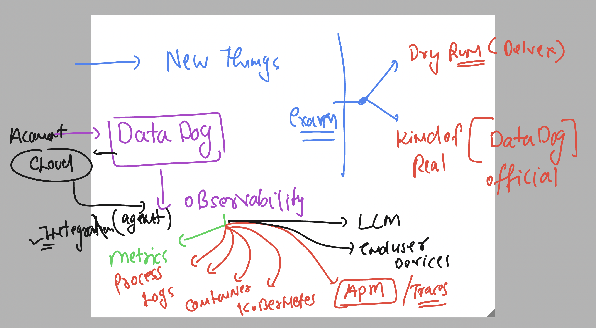
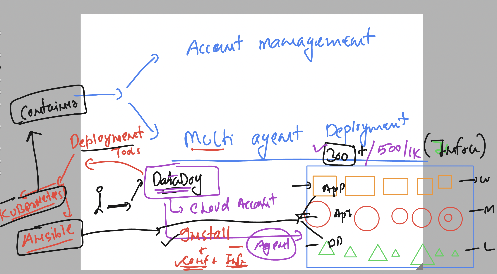
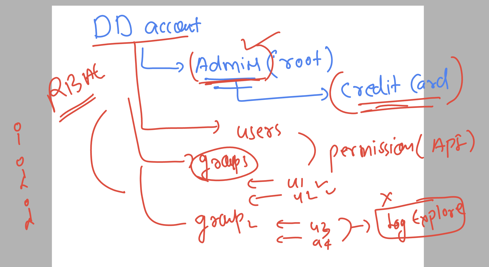
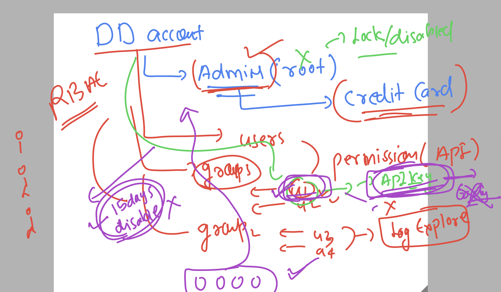
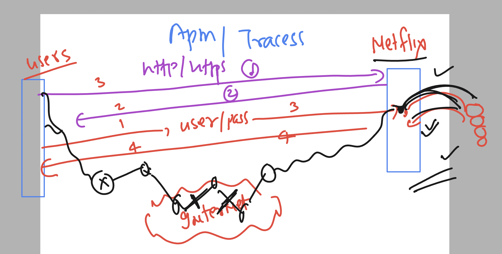
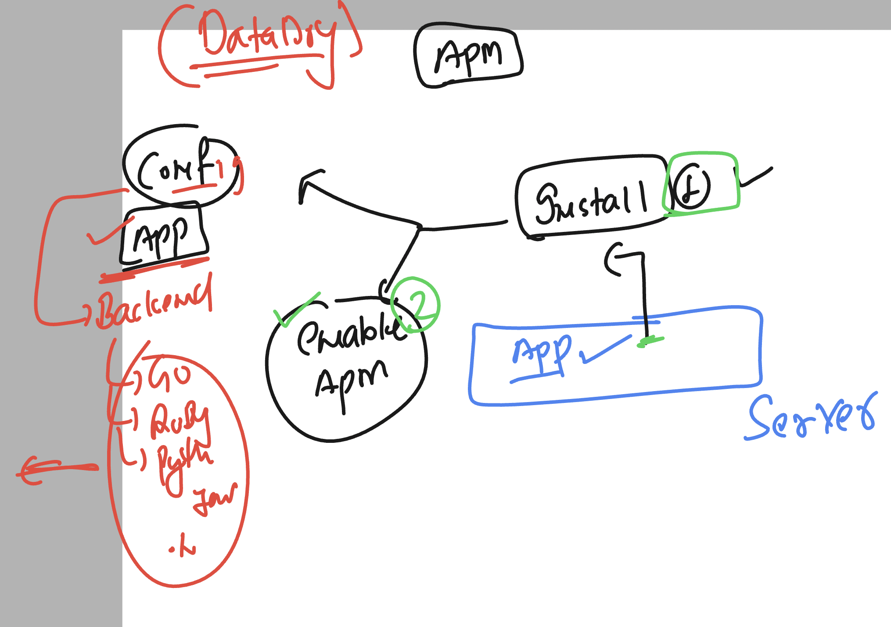
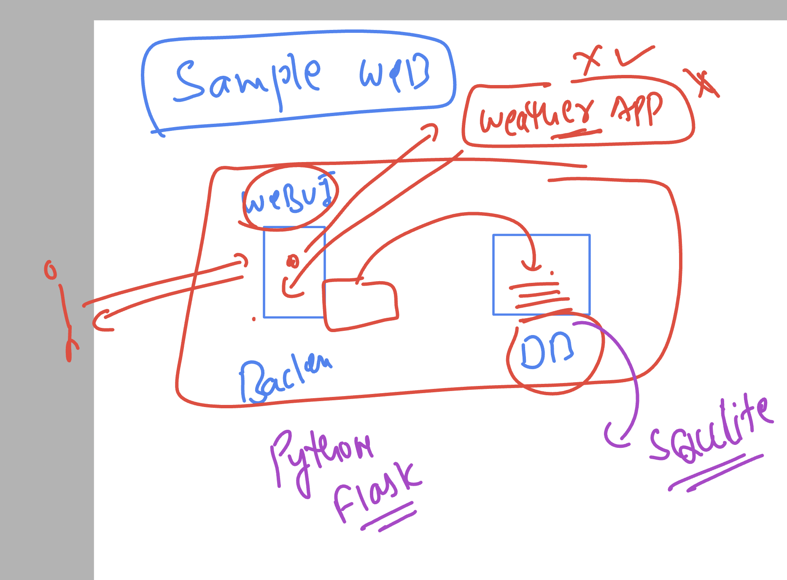
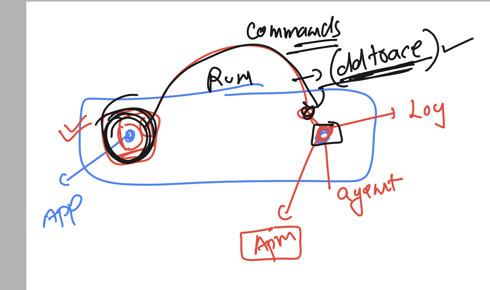

### Overall Datadog features & understanding 



### automation in Installation of Multiple agents on various target systems



### ANsible info 


### User and Permission management in Datadog account 



### account disable 



### check datadog agent status on linux machine 

```
[ec2-user@ip-172-31-92-124 ~]$ sudo -i
[root@ip-172-31-92-124 ~]# hostname
ip-172-31-92-124.ec2.internal
[root@ip-172-31-92-124 ~]# systemctl status datadog-agent
● datadog-agent.service - Datadog Agent
     Loaded: loaded (/usr/lib/systemd/system/datadog-agent.service; enabled; preset: disabled)
     Active: active (running) since Wed 2024-10-23 07:45:16 UTC; 1min 14s ago
   Main PID: 2088 (agent)
      Tasks: 8 (limit: 4658)
     Memory: 273.1M
        CPU: 2.358s
     CGroup: /system.slice/datadog-agent.service

===> check component based status

datadog-agent  status
```

### verify httpd app server 

```
systemctl status httpd
○ httpd.service - The Apache HTTP Server
     Loaded: loaded (/usr/lib/systemd/system/httpd.service; disabled; preset: disabled)
     Active: inactive (dead)
       Docs: man:httpd.service(8)
[root@ip-172-31-92-124 ~]# 
[root@ip-172-31-92-124 ~]# systemctl start httpd
[root@ip-172-31-92-124 ~]# systemctl status httpd
● httpd.service - The Apache HTTP Server
     Loaded: loaded (/usr/lib/systemd/system/httpd.service; disabled; preset: disabled)
     Active: active (running) since Wed 2024-10-23 07:50:24 UTC; 1s ago
       Docs: man:httpd.service(8)
   Main PID: 3852 (httpd)
     Status: "Started, listening on: port 80"
      Tasks: 177 (limit: 4658)
     Memory: 17.8M
        CPU: 68ms
```

### verify httpd logs on server 

```
[root@ip-172-31-92-124 ~]# tail  -f /var/log/httpd/access_log
52.102.17.117 - - [22/Oct/2024:10:02:08 +0000] "HEAD / HTTP/1.1" 200 - "-" "-"
40.94.97.57 - - [22/Oct/2024:10:06:18 +0000] "GET / HTTP/1.1" 200 271 "-" "Mozilla/5.0 (Windows NT 10.0; Win64; x64) AppleWebKit/537.36 (KHTML, like Gecko) Chrome/127.0.6523.4 Safari/537.36"
40.94.97.23 - - [22/Oct/2024:10:06:28 +0000] "GET /favicon.ico HTTP/1.1" 404 196 "http://44.201.200.63/" "Mozilla/5.0 (Windows NT 10.0; Win64; x64) AppleWebKit/537.36 (KHTML, like Gecko) Chrome/127.0.6523.4 Safari/537.36"
82.62.147.36 - - [22/Oct/2024:10:25:34 +0000] "GET / HTTP/1.0" 200 271 "-" "Mozilla/5.0 (Linux; U; Android 4.0.3; ko-kr; LG-L160L Build/IML74K) AppleWebkit/534.30 (KHTML, like Gecko) Version/4.0 Mobile Safari/534.30"
114.35.2.131 - - [22/Oct/2024:10:29:40 +0000] "GET / H

```

## Understanding APM 



### APM detailed understanding 



### by default datadog trace agent in running on 8126 port 

```
netstat -nltp
Active Internet connections (only servers)
Proto Recv-Q Send-Q Local Address           Foreign Address         State       PID/Program name    
tcp        0      0 127.0.0.1:44025         0.0.0.0:*               LISTEN      2096/containerd     
tcp        0      0 127.0.0.1:5000          0.0.0.0:*               LISTEN      2088/agent          
tcp        0      0 127.0.0.1:5001          0.0.0.0:*               LISTEN      2088/agent          
tcp        0      0 127.0.0.1:5012          0.0.0.0:*               LISTEN      2090/trace-agent    
tcp        0      0 127.0.0.1:6162          0.0.0.0:*               LISTEN      2089/process-agent  
tcp        0      0 127.0.0.1:6062          0.0.0.0:*               LISTEN      2089/process-agent  
tcp        0      0 127.0.0.1:8126          0.0.0.0:*               LISTEN      2090/trace-agent    
tcp        0      0 0.0.0.0:22              0.0.0.0:*               LISTEN      2286/sshd: /usr/sbi 
tcp6       0      0 :::80                   :::*                    LISTEN      3852/httpd          
tcp6       0      0 :::22                   :::*                    LISTEN      2286/sshd: /usr/sbi 
[root@ip-172-31-92-124 ~]# 

```

## Basic info about  webapp




### cloning webapp 

```
 cd /opt/
[root@ip-172-31-92-124 opt]# git clone https://github.com/redashu/resources.git
Cloning into 'resources'...
remote: Enumerating objects: 470, done.
remote: Counting objects: 100% (470/470), done.
remote: Compressing objects: 100% (325/325), done.
remote: Total 470 (delta 130), reused 398 (delta 80), pack-reused 0 (from 0)
Receiving objects: 100% (470/470), 6.62 MiB | 29.33 MiB/s, done.
Resolving deltas: 100% (130/130), done.

[root@ip-172-31-92-124 opt]# 
[root@ip-172-31-92-124 opt]# 
[root@ip-172-31-92-124 opt]# ls
aws  containerd  datadog-agent  resources
[root@ip-172-31-92-124 opt]# 

```

### copy only requred code 

```
 ls
aws  containerd  datadog-agent  resources
[root@ip-172-31-92-124 opt]# cp -rf resources/webappss/python-flask-weathermap/   .
[root@ip-172-31-92-124 opt]# ls
aws  containerd  datadog-agent  python-flask-weathermap  resources
[root@ip-172-31-92-124 opt]# 


===> go to folder

 cd python-flask-weathermap 
[root@ip-172-31-92-124 python-flask-weathermap]# ls
env_var.bat  requirements.txt  templates  weather_1.py
[root@ip-172-31-92-124 python-flask-weathermap]# 

```

### To run python webapp -- we need to do some installation 

```
yum install python3-pip -y

==>
ls
env_var.bat  requirements.txt  templates  weather_1.py
[root@ip-172-31-92-124 python-flask-weathermap]# 
[root@ip-172-31-92-124 python-flask-weathermap]# 
[root@ip-172-31-92-124 python-flask-weathermap]# pip install  -r requirements.txt 
Collecting attrs==22.1.0
  Downloading attrs-22.1.0-py2.py3-none-any.whl (58 kB)
     |████████████████████████████████| 58 kB 3.6 MB/s             
Collecting bytecode==0.13.0
  Downloading bytecode-0.13.0-py3-none-any.whl (53 kB)
     |████████████████████████████████| 53 kB 3.5 MB/s             
Collecting cattrs==22.2.0
  Downloading cattrs-22.2.0-py3-none-any.whl (35 kB)

```

### In some cases your app may show incompatibilty error so UPgrade libs

```
 pip install --upgrade SQLAlchemy Flask-SQLAlchemy
```

### run your app

```
python3  weather_1.py 
 * Serving Flask app 'weather_1'
 * Debug mode: off
WARNING: This is a development server. Do not use it in a production deployment. Use a production WSGI server instead.
 * Running on all addresses (0.0.0.0)
 * Running on http://127.0.0.1:8000
 * Running on http://172.31.92.124:8000
Press CTRL+C to quit
106.219.68.125 - - [23/Oct/2024 09:31:36] "GET / HTTP/1.1" 200 -
106.219.68.125 - - [23/Oct/2024 09:31:37] "GET /favicon.ico HTTP/1.1" 404 -


```

### lets run app by datadog -- using ddtrace




### Installing ddtrace 

```
pip install --upgrade ddtrace
```
### running app after setting env 

```
                                                 DD_SERVICE="ashu-flask"
[root@ip-172-31-92-124 python-flask-weathermap]# DD_ENV="dev"
[root@ip-172-31-92-124 python-flask-weathermap]# DD_LOGS_INJECTION=true
[root@ip-172-31-92-124 python-flask-weathermap]# ls
env_var.bat  requirements.txt  templates  weather.db  weather_1.py
[root@ip-172-31-92-124 python-flask-weathermap]# ddtrace-run  python3  weather_1.py  


```
